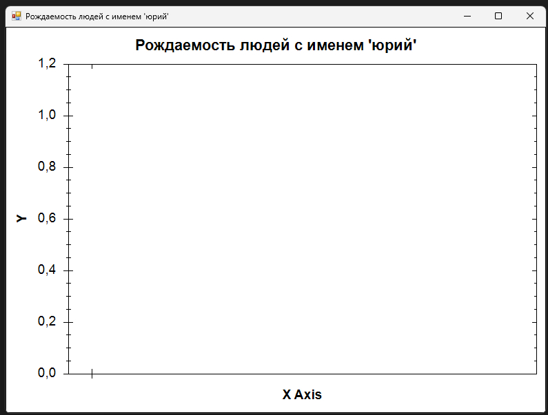

# Платформа: ulearn
## Курс: Основы программирования
### Тема: 4 Массивы
#### Практика «Гистограмма»
##### Решено 09 октября 2022 в 23:38

В классе HistogramTask написан код подготовки данных для гистограммы частоты рождаемости в зависимости от числа (номера дня в месяце) их рождения для заданного имени.

В это задаче используются реальные данные о людях. Но так получилось, что в базе данных для всех людей с неизвестной датой рождения, в качестве даты рождения используется первое число месяца. Во время работы с реальными базами данных, часто всплывают подобные особенности. Чтобы это не мешало нам в этой задаче, не учитываем тех, кто родился 1 числа любого месяца.

В качестве подписей (label) по оси X используем массив размером 31 элемент со значениями от 1 до 31.

Пример подготовки данных для гистограммы в файле HistogramSample.cs

Код должен корректно работать на любых данных, а не только на том наборе, которые содержится в архиве с задачей. 

